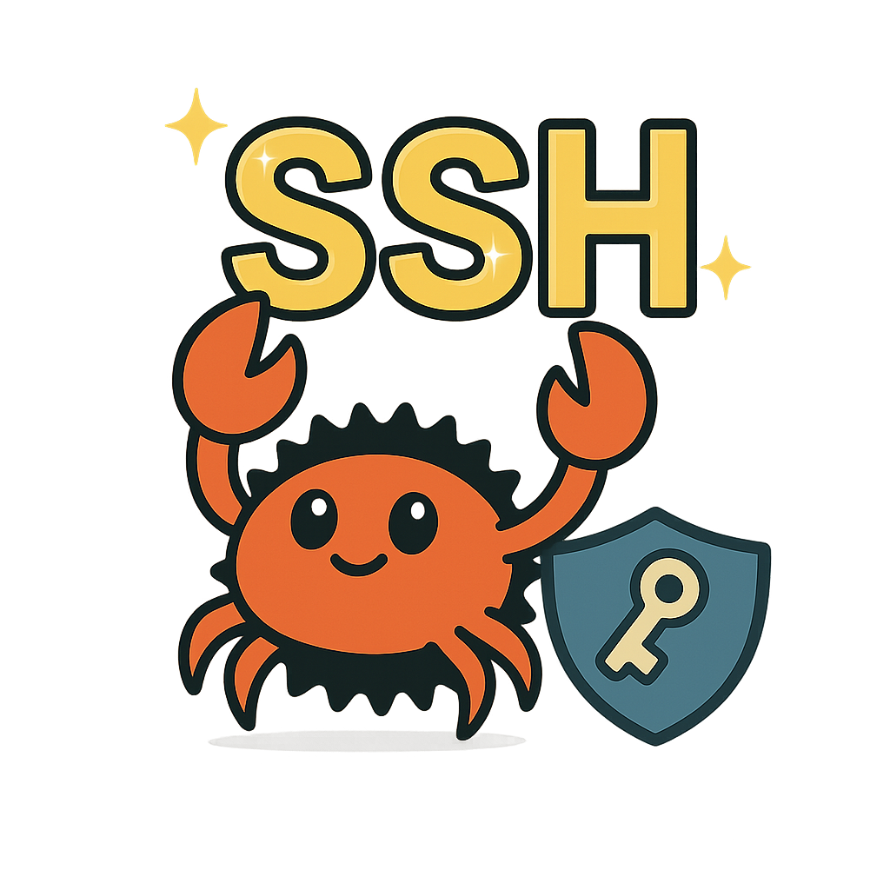

# 🛡️ RustSSH - Remote Administration Tool

A secure SSH-like remote administration tool written in **Rust** that allows users to execute commands on a remote server through an **encrypted connection**.

<div align="center">
  
</div>

---

## 🌟 Features

### 🔐 Secure Authentication
- Password-based authentication with **Argon2** password hashing
- Certificate-based authentication *(placeholder for future implementation)*

### 🔒 Encrypted Communication
- **TLS encryption** using `rustls` for secure client-server communication
- Server certificate verification

### 🖥️ Remote Command Execution
- Execute shell commands on the remote server
- Navigate the file system with built-in commands:
  - `cd` – Change directory
  - `pwd` – Print working directory
  - `ls` – List directory contents
- Exit connection gracefully with the `exit` command

### 👥 User Management
- User database with **encrypted passwords**
- Automatic user creation on first login

---

## 📝 Usage

### ▶️ Starting the Server

```sh
cd server
cargo run
```

The server will start on **127.0.0.1:9999** by default.

### 💻 Connecting with a Client

```sh
cd client
cargo run <username>
```

Enter your password when prompted.  
If this is your **first time logging in**, an account will be automatically created.

---

## 🧾 Available Commands

| Command          | Description                                       |
|------------------|---------------------------------------------------|
| `cd <directory>` | Change the current directory *(not working yet)* |
| `pwd`            | Show the current directory path *(not working yet)* |
| `ls`             | List files and directories in the current directory |
| `exit`           | Close the connection to the server               |

---

## 🧩 Project Structure

```
.
├── common   # Shared code between client and server
│   ├── Authentication protocols
│   ├── Cryptographic functions
│   ├── Message types
│   └── Network configuration
│
├── client   # Client implementation
│   ├── TLS connection handling
│   ├── Command input/output display
│   └── Authentication process
│
└── server   # Server implementation
    ├── TLS connection handling
    ├── Command execution
    ├── File system navigation
    └── User database management
```

---

## 🔒 Security Features

- **Password Security**: Passwords are never stored in plain text.  
  → They are hashed using the **Argon2** algorithm.
- **Encrypted Communication**: All traffic is encrypted using **TLS 1.3**.
- **Certificate Validation**: Server certificates are validated to prevent **MITM attacks**.

---

## 🎓 Project Information

This project was developed as part of the **Master 1 Cybersecurity**  
at **Université de Rennes (2025)**.

---

## 📜 License

This project is licensed under the **MIT License**.  
See the [`LICENSE`](LICENSE) file for details.

---

## 🙏 Acknowledgements

Special thanks to **roxydium** for its help on some features.
